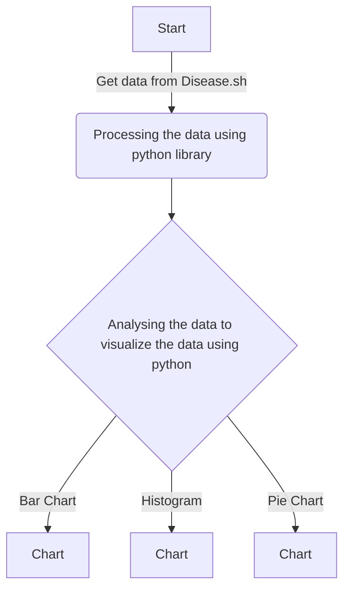

```mermaid
graph TD
    A[Start] -->|Get data from Disease.sh| B(Processing the data using python library)
    B --> C{Analysing the data to visualize the data using python}
    C -->|Bar Chart| D[Chart]
    C -->|Histogram| E[Chart]
    C -->|Pie Chart| F[Chart]
```

